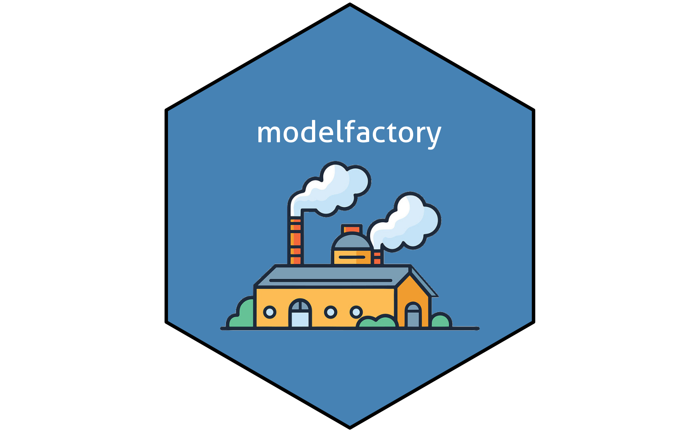

# Questions 

- How does `plot()` determine what object classes it can plot? 
  - methods(class = class(lm_1))
- do we need qualified calls to everything, i.e. dplyr::left_join?
  - Yes but what about "base" packages i.e. stats
  
# TODO

- maybe put helpers in different file 
- function to get betas + C.I. + coeff
- look at R idiomatic syntax
- unit tests 

# Installation

You can install the development version of modelfactory with: 
      
``` r
# install.packages("devtools")
devtools::install_github("WillTirone/modelfactory")
```

# Notes 

- currently on: 4.5.2

- important commands: 
  - load devtools 
  - load_all() -> most important in workflow!
  - check() 
  - code > insert roxygen skeleton
  - document() -> "converts" roxygen to something accessible with ?func
  
# Workflow: 

- write code 
- load_all() -> directly loads package in memory 
- try code 
- verify with check() 
  - run this often to find problems early
